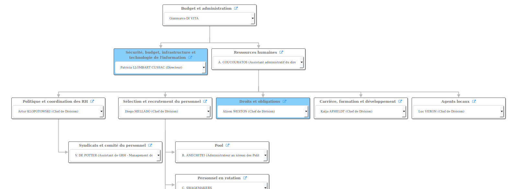
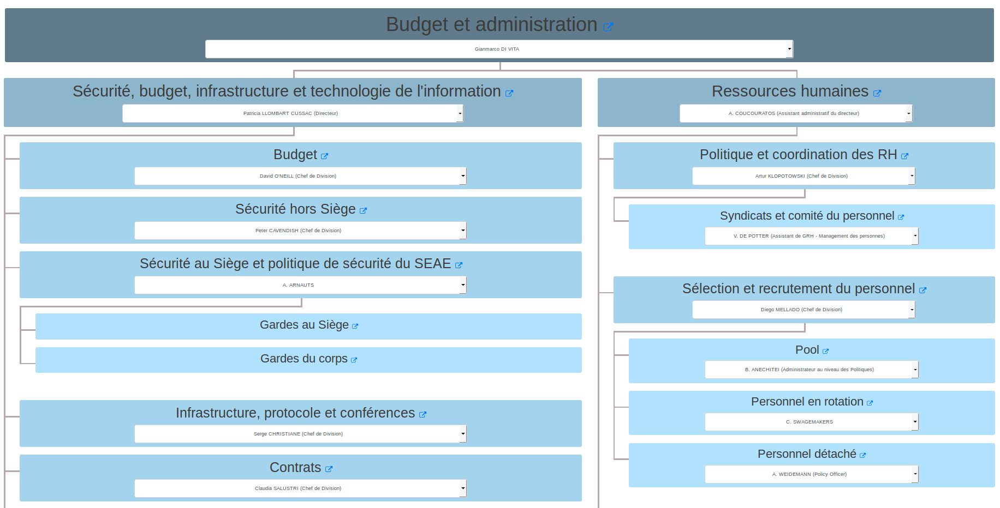

# ORGviz

## Introducing ORGviz

The [**ORGviz**](http://orgviz.eu) project brings a **simple visualisation tool for government agencies and companies** which need to create graphical representation of their organisational charts.

ORGviz enables users to understand organisation of public services at a glance and navigate through organisational charts to identify services and persons in charge.

_The ORGviz online service is at [**http://orgviz.eu**](http://orgviz.eu)._

## ORGviz output

ORGviz can generate the following types of output :

### Unfoldable tree using treant

Leveraging [Treant.js](http://fperucic.github.io/treant-js/) Javascript library.

### HTML list view

Displaying the hierarchy and list of members of each organization.
Including nice semantic SEO [schema.org](http://schema.org) markup.

### HTML responsive view

Responsive output for displaying your organization's chart on your iPhone !

## ORG data

ORGviz is based on the [Organization ontology](https://www.w3.org/TR/vocab-org/) (abbreviated "ORG ontology"), a W3C standard to describe organization data, sub-organizations, membership, sites, etc.

The tool takes in account few properties added by the [EU Who is Who](http://europa.eu/whoiswho) project to arrange structures and persons with specific orders based on protocol or responsibility level (The "euvoc" ontology, accessible from [this page](http://publications.europa.eu/mdr/cdm/index.html)).

## CPOV

The Core Public Organization Vocabulary, or [CPOV](https://joinup.ec.europa.eu/solution/core-public-organisation-vocabulary) , defines a specific subclass of Organization : [PublicOrganization](http://data.europa.eu/m8g/PublicOrganisation). ORGviz can handle instances of CPOV PublicaOrganization because it internally loads the CPOV ontology and does RDFS inference on it.

As ORGviz does RDFS inference on the data provided to it, other refinements of the ORG ontology can also be handled, provided the model (declaration of the subClassOf and subPropertyOf links) is submitted to the service along with the data;

## Current limitations

The online ORGviz service is limited to :
 - 80 Organizations maximum in a single file;
 - A maximum depth of 4 in the organization hierarchy tree;

If you need more, please get in touch !

## Contact - Who we are

Thomas Francart & Jean Delahousse, you can send us a mail at **"contact at orgviz dot eu"**. You can also use the [contact form of Sparna](http://www.sparna.fr/contact/).

We happily share our 30+ cumulated years of experience in semantic web technologies with public administrations in France and worldwide !

Thomas is blogging [here](http://blog.sparna.fr) on semantic web (in French), and has also developped, amongst other [SKOS Play](http://labs.sparna.fr/skos-play), a suite of tools to visualize, convert and validate SKOS data.
